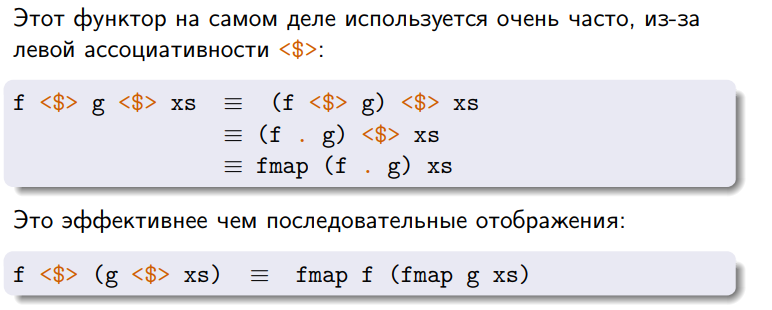
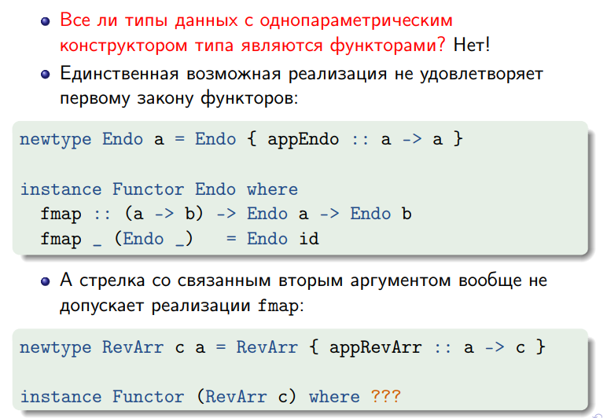

# 14. Класс типов `Functor` и его представители

[презентация](https://wiki.compscicenter.ru/images/6/6b/Fpc08HSE2021.pdf)

## Класс типов `Functor`

Представители класса типов `Functor` должны быть консрукторами типа с одним параметром (то есть `f :: * -> *`). Функторы задают способ "поднять стрелку на уровень контейнера". Для определения Функтора нам надо задать `fmap`.

```haskell
class Functor f where
    fmap :: (a -> b) -> (f a -> f b)
```
- Важное свойтво всех функторов - **структура контейнера не меняется**. Если был список 5 элементов, то останется список из 5 элементов и т.п.. Элементы затрагиваются, а структура не меняется. (спойлер - это закон)

`<$>` - инфиксный аналог `fmap`

В общем случае для `fmap` надо написать реакцию для каждого конструктора данных типа с помощью паттернматчинга. Таким образом распоковав контейнер, применив функцию и запоковав обратно тем же конструктором.

Полное определение класса типов `Functor`:
```haskell
infixl 4 <$, <$>, $>
class Functor f where
    -- эти функции можно перегрузить
    fmap :: (a -> b) -> f a -> f b
    (<$) :: a -> f b -> f a     -- вместо функции одно занчение - 
    (<$) = fmap . const         -- заменяет все элементы контейнера на то, что передали

-- эти перегрузить нельзя
(<$>) :: Functor f => (a -> b) -> f a -> f b
(<$>) = fmap

($>) :: Functor f => f a -> b -> f b
($>) = flip (<$)
```
Как работает: стрелочка смотрит туда, откуда берётся занчение.
Примеры для понимания, как работают половинчатые кусочки доллара:
```GHCi
> Just 42 $> "foo"
Just "foo"
> Nothing $> "foo"
Nothing
> Nothing <$ "foo"
[Nothing,Nothing,Nothing]
```

Дополнительные стандартные функции из `Data.Functor`
```haskell
void :: Functor f => f a -> f ()
void x = () <$ x

infixl 1 <&>        -- Base 4.11.0.0 GHC 8.4.1 (Mar 2018)
(<&>) :: Functor f => f a -> (a -> b) -> f b
xs <&> f = f <$> xs
```

Примеры применения
```GHCi
> void "ABCD"
[(),(),(),()]
> (+10) <$> (^2) <$> [1,2,3]
[11,14,19]
>[1,2,3] <&> (^2) <&> (+10)
[11,14,19]
```

## Представители класса `Functor` 

для списка и для `Maybe`
```haskell
instance Functor [] where
    fmap _ []     = []
    fmap g (x:xs) = g x : fmap g xs

instance Functor Maybe where
    fmap _ Nothing  = Nothing
    fmap g (Just a) = Just (g a) 
```
для дерева:

```haskell
data Tree a = Leaf a | Branch (Tree a) a (Tree a)

instance Functor Tree where
    fmap :: (a -> b) -> (Tree a -> Tree b)  -- для того, чтобы писать тут не общую сигнатуру,
                                            -- a частную, надо подключить расширение InstanceSigs
    fmap g (Leaf x)       = Leaf (g x)
    fmap g (Branch l x r) = Branch (fmap g l) (g x) (fmap g r)
```

Пример работы:
```GHCI
> testTree = Branch (Leaf 2) 3 (Leaf 4)
> fmap (^2) testTree
Branch (Leaf 4) 9 (Leaf 16)
> (^3) <$> testTree
Branch (Leaf 8) 27 (Leaf 64)
```

### Представители класса `Functor` для двухпараметрических типов данных

Стнадартные двухпараметрические типы данных: `Either`, `(,)` - пара, `(->)` - частично применённая стрелка. Требуется связать первый параметр, чтобы можно было объявить их представителями функтора, так как иначе они не сходятся по кайнду.

Представитель класса `Functor` для `Either`:
```haskell
instance Functor (Either e) where   -- e от слова error
    fmap :: (a -> b) -> Either e a -> Either e b
    fmap _ (Left x)  = Left x
    fmap g (Right y) = Right (g y)
```

Представитель класса `Functor` для пары:

```haskell
instance Functor ((,) s) where
    fmap :: (a -> b) -> (s,a) -> (s,b)
    fmap g (x,y) = (x, g y)
```

Представитель класса `Functor` для частично применённой стрелки:

```haskell
instance Functor ((->) e) where     -- e от слова environment
    --fmap :: (a -> b) -> ((->) e a) -> ((->) e b)    --  мы должны написать такую конструкцию
    -- но если мы её распишем и развернём все частичные применения, то получим
    fmap :: (a -> b) -> (e -> a) -> (e -> b)    -- а это просто композиция 
    fmap = (.)
```

Неформально это можно описать как "здесь лежит рецепт, как по типу e получить тип a", потому что в понимание контейнера частично применённая стрелка как-то в мозгу не укладывается. Тогда если у тебя есть рецепт, как получать из у значение типа а, и есть функция из а в b, то ты можешь получить рецепт, как получить из e значение типа b.

 

## Законы для Функторов

Для любого представителя класса типов `Functor` должно выполняться два закона:
```haskell
fmap id      = id
fmap (f . g) = fmap f . fmap g  -- на самом деле можно доказать, что из первого следует второй
                                -- но это работает так в Хаскеле, а стырили эти законы из теорката
                                -- (теории категорий) и их там было 2
```
Смчсл законов: вызов `fmap g` не должен менять "структуру контейнера", воздействуя только на элементы.

Эти законы выполняются для всех стандартных библиотечных функторов.

Эти законы можно и не выполнять, если сильно хочется и написать "плохого" представителя класса `Functor` для списка. Он нарушает оба закона (ну и вообще очевидно, что он плохой, так как он меняет структуру списка - количество элементов изменяется).

```haskell
instance Functor [] where
    fmap _ []     = []
    fmap g (x:xs) = g x : g x : fmap g xs
```
Тут комментарии излишни. </br>
 
