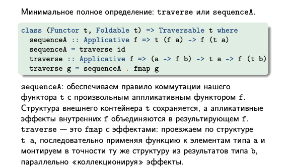
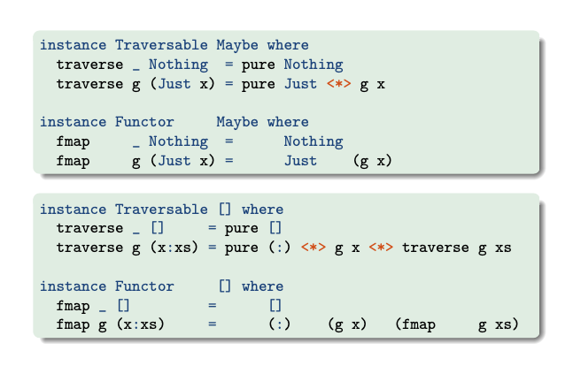
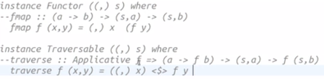
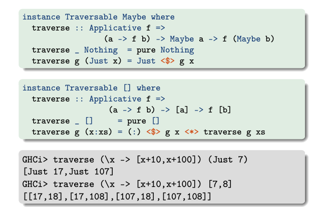
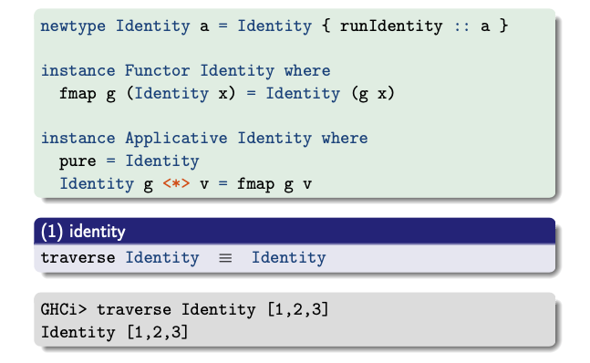
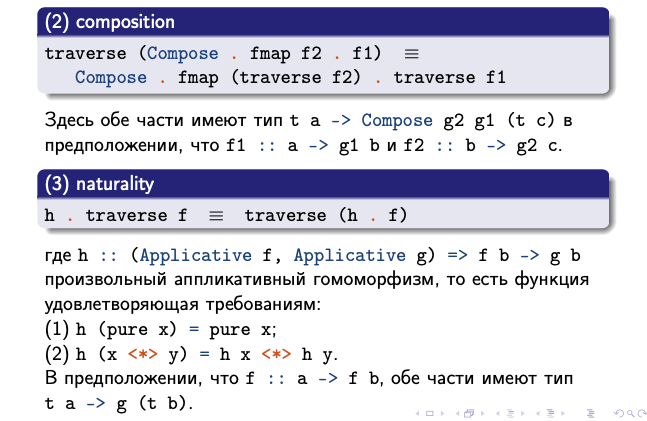
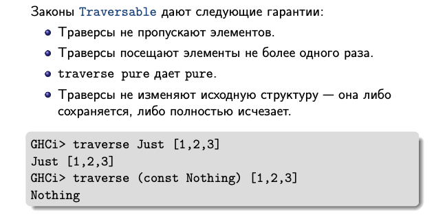

Знаем Applicative и Alternarive, а также Foldable. Теперь мы хотим увидеть их взаимодействие.

To traverse означает "проходить по", именно это Traversable и обобщает: проход по структуре данных, собирая результаты на каждом шаге.

```Haskell
fold :: (Foldable t, Monoid m) => t m -> m
fold = foldr <> mempty

```

Тут была свертка, где снаружи Foldable контейнер, а внутри Alternative.

```Haskell
asum :: (Foldable t, Alternative f) => t (f a) -> f a
asum = foldr (<|>)  empty

```

Хотим свертку по умолчанию где снарузи Foldable, а внутри Applicative

```Haskell
sequenceA_ :: Applicative f => t (f a) -> f ()
sequenceA_ = foldr (*>) (pure())
-- (*>) забывает значения левого аргумента, копит его значения, а возвращает правый

```
`sequenceA` как раз производит эффекты, накапливая значения

Так мы заменили контекст `Monoid` функции `fold` на контекст `Applicative` и получили `sequenceA_ `

`foldMap` тоже имеет контекст моноида, можно ли в ней заменить `Monoid` на `Applicative`

```Haskell
foldMap :: Monoid m => (a -> m) -> t a -> m
foldMap f = doldr (mappend . f) mempty

Applicative :: (Foldable t, Applicative f) => (a -> f b) -> t a -> f ()
traverse_ = foldr ((*>) . f) (pure())
```
`traverse_` проезжается по контейнеру с элементами произвольного типа и превращает их в `Applicative `, а дальше производит свертку, производя эффекты и отбрасывая значения типа b

Пример:
```Haskell
traverse_ (\x->(show x, 2*x)) [1,2])
("12", ())

traverse_ (\x->[x+10,x+20]) [1,2,3]
[(),(),(),(),(),(),(),()]
```

Функции с подчеркиванием игнорировали значения, но производили эффекты аппликативного функтора.

Но можно ли написать без усеченную, а полную версию, чтобы не игнорировались значения.
Haskell
```Haskell
sequenceA2list :: (Foldable t, Applicative f) => t (f a) -> f [a]
sequenceA2list = foldr (\x y -> pure (:) <*> x <*> y) (pure [])
```
Вообще тут мы сводим любую `Foldable` структуру к списку, но хотим обобщить.

С `Foldable` это невозможно, так как сворачивать структуру мы можем, а перевозрождать для каждого типа не умеет

`Traversible` как раз позволяет позволяет пройтись по контейнеру, произвести эффекты снаружи, а внутри перевозродить структуру.

```Haskell
sequenceA :: Applicative f => t (f a) -> f (t a)
```

## Класс типов Traversible


`Traversible ` позволяет проезжаться по структуре, накапливая эффекты

`Traversible ` переаозрождает структуру с учетом эффектов

```Haskell
class (Functor t, Foldable t) => Traversable t where
  sequenceA :: Applicative f => t (f a) -> f (t a)
  traverse :: Applicative f => (a -> f b) -> t a -> f (t b)
```
`sequenceA` - что значит переставить контейнеры

`traverse ` - контейнер не содержит `Applicative `, но у нас есть функция, которая по значениям типа позволяет породить некоторые `Applicative `. То есть проезжаем по контейнеру, производим эффекты, накопим их снаружи, а внутри переродим.

Они вырожаются через друг друга 

```Haskell
class (Functor t, Foldable t) => Traversable t where
  sequenceA :: Applicative f => t (f a) -> f (t a)
  sequenceA = traverse id   -- id :: fb ->fb
  traverse :: Applicative f => (a -> f b) -> t a -> f (t b)
  traverse g = sequenceA . fmap g
```

## Сравнение реализация Traversible и Functor

Код представителя `Traversible` и `Functor` для этого класса типов похож



Поднимаем в `Applicative`.....

Хм, получается, можно смотреть на `Functor` и писать `Traversible`



## Представители класса типов Traversible

Напишем тогда представителя!




## Первый закон Traversible


## Реализация fmap по умолчанию


## Второй и третий законы Traversible


## Практический смысл законов

