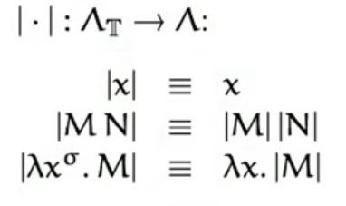
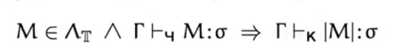
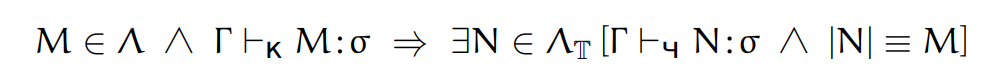

# 14. Связь между системами Карри и Чёрча. Проблемы разрешимости. Сильная и слабая нормализация.

[презентация](https://wiki.compscicenter.ru/images/b/be/Fpc03HSE2021.pdf)  
про связь смотри конец презентации, системы где-то посередине (+- 7 слайд)

## Системы и связь
### Системы в стиле Карри
- Термы те же, что и в бестиповой теории. Каждый терм обладает множеством различных типов (пустое, одно- или многоэлементное, бесконечное)
Системы в стиле Карри: Haskell, Ocaml

### Системы в стиле Чёрча
- Термы - аннотированные версии бестиповых термов. Каждый терм имеет тип (обычно уникальный), выводимый из способа, которым терм аннотирован. (тут тип приписывают сверху как степень)
Системы в стиле Чёрча: большинство типизированных языков (императивные почти все)

Связь между "вычислительными" и логическими системами называют *соответствием Карри-Говарда*

**Судя по всему Москвин не успел нам рассказать это на лекции, так что всё, что тут далее написано есть пересказ слайдов третьей презентации и тайных знаний второгодника**

### Связь между системами Карри и Чёрча
Смотри слайд 35 третьей презентации
Между системами Карри и Чёрча есть взаимно однозначная связь: мы можем задать   
*стирающее отображение*:  

При стирании получается из Чёрчевского терма Карриевский терм. мы просто везде у Чёрча убираем "степени". То есть для люого утверждения типизации в Чёрчевской системе мы, применив стирающее отображение, получим верное утверждение в Карриевской системе и наоборот, если у нас есть утверждение в Карриевской системе, то мы можем придумать такое подписывание "степенями" для чёрчевской системы, что оно будет верно. Формальная запись утверждения слева направо: 

 Формальная запись утверждения справа налево:

 

### Проблемы разрешимости
(здесь говорим про замкнутые термы)
1. ЗПТ (TCP) - Задача проверки типа (Type Checking problem): написано "М имеет тип сигма" - верно ли это утверждение в этом контексте? Это алгоритмически разрешимая задача.
2. ЗСТ (TSP, TAP) - Задача синтеза типа (Type Synthesys (or Assignment) Problem): написан терм М - можем ли мы найти для него за конечное число шагов тип или сказать, что он не имеет типа? Да, задача разрешима (смотри алгоритм Хиндли-Милнера (билет 18-19)) (самая важная с прикладной точки зрения из этих трёх)
3. ЗОТ (TIP) - Задача обитаемости типа (Type Inhabitation Problem): (про неё на 3 курсе) есть тип сигма, есть ли у него терм? По заданному типу либо предъявить замкнутый терм, который является его обитателем, либо за конечное число шагов сказать, что нет у этого типа обитателей. Для нашей простой системы задача разрешима. (задача поиска доказательства в некоторой логике)

### Слабая и сильная нормализация

#### Определение:
- Терм называют __*слабо (weak) нормализуемым*__ (WN), если **существует** последовательность редукций, приводящих его к нормальной форме.

#### Определение:
- Терм называют __*сильно (strong) нормализуемым*__ (SN), если **любая** последовательность редукций приводит его к нормальной форме

Примеры:
1. Терм **K I K** - сильно нормализуем
2. Терм **K I \Omega** - слабо нормализуем
3. Терм **\Omega** - вообще не нормализуем

#### Определение:
- Систему типов называют __*слабо нормализуемой*__ если все её допустимые термы слабо нормализуемы.

#### Определение:
- Систему типов называют __*сильно нормализуемой*__ если все её допустимые термы сильно нормализуемы.

#### **Теорема о нормализации**
- Обе системы (и Карри и Чёрча) в системе лямбда-стрелочка сильно нормализуемы, то есть любой допустимый терм всегда редуцируется к нормальной форме.

#### Определение-напоминание:
- Лямбда терм М находится в бета-нормальной форме, если в нём нет подтермов, являющихся бета-редексами. (Нормальная форма - это когда редуцировать некуда). Подробнее смотри 7 билет.